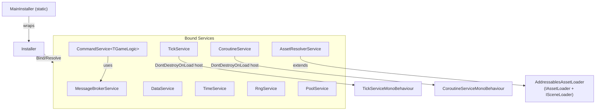

# Geuneda.Services - AI 에이전트 가이드

> **관련 파일**: `CLAUDE.md`는 Claude Code용으로 이 파일을 감쌉니다 — `CLAUDE.md`가 아니라 `AGENTS.md`를 편집하세요. `README.md`는 사용자 대상 진입점이며, `docs/`에는 서비스별 상세 API 레퍼런스가 있습니다.

## 1. 패키지 개요
- **패키지**: `com.geuneda.services`
- **Unity**: 6000.0+
- **의존성** (`package.json` 참조 — 여기 적힌 버전은 항상 동기화되어야 합니다)
  - `com.geuneda.gamedata` (**1.0.0**) — `RngService`에서 사용하는 `floatP` 제공
  - `com.unity.addressables` (**1.21.20**) — 에셋 로딩 및 씬 로딩
  - `com.cysharp.unitask` (**2.5.10**) — 에셋 로딩을 위한 async/await 지원

이 패키지는 Unity 프로젝트를 위한 소규모 모듈식 "기반 서비스" 세트(서비스 로케이터/경량 DI, 메시징, 틱, 코루틴, 풀링, 영속성, RNG, 시간, 커맨드 패턴, 빌드 버전 헬퍼)와 Addressables 기반 에셋 로딩/임포팅 도구(v2.0.0에서 `com.geuneda.assetsimporter` v0.5.2로부터 흡수)를 제공합니다.

**대상 독자**: 이 파일은 패키지 자체를 작업하는 기여자/에이전트를 위한 것입니다. 사용자 대상 문서는 `README.md`(빠른 시작, 서비스별 예제)와 `docs/`(전체 API 레퍼런스)를 참조하세요.

## 2. 런타임 아키텍처 (상위 수준)

### 인터페이스 → 구현 조회

| 인터페이스 | 네임스페이스 | 구현 | 파일 |
|-----------|-----------|---------------|------|
| `IInstaller` | `Geuneda.Services` | `Installer` | `Runtime/DependencyInjection/Installer.cs` |
| `IMessageBrokerService` | `Geuneda.Services` | `MessageBrokerService` | `Runtime/MessageBrokerService.cs` |
| `ITickService` | `Geuneda.Services` | `TickService` | `Runtime/TickService.cs` |
| `ICoroutineService` | `Geuneda.Services` | `CoroutineService` | `Runtime/CoroutineService.cs` |
| `IPoolService` | `Geuneda.Services.Pooling` | `PoolService` (ns `Geuneda.Services`) | `Runtime/Pooling/IPoolService.cs`, `Runtime/PoolService.cs` |
| `IObjectPool<T>` | `Geuneda.Services.Pooling` | `ObjectPool<T>`, `GameObjectPool`, `GameObjectPool<T>` | `Runtime/Pooling/` |
| `IDataProvider` / `IDataService` | `Geuneda.Services` | `DataService` | `Runtime/DataService.cs` |
| `ITimeService` / `ITimeManipulator` | `Geuneda.Services` | `TimeService` | `Runtime/TimeService.cs` |
| `IRngService` | `Geuneda.Services` | `RngService` | `Runtime/RngService.cs` |
| `ICommandService<TGameLogic>` | `Geuneda.Services.Commands` | `CommandService<TGameLogic>` (ns `Geuneda.Services`) | `Runtime/Commands/ICommandService.cs`, `Runtime/CommandService.cs` |
| `IGameCommand<TGameLogic>` / `IGameServerCommand<TGameLogic>` | `Geuneda.Services.Commands` | *(사용자 정의 커맨드)* | `Runtime/Commands/IGameCommand.cs` |
| `IAssetLoader` | `Geuneda.Services.AssetsImporter` | `AddressablesAssetLoader` | `Runtime/AssetsImporter/AddressablesAssetLoader.cs` |
| `ISceneLoader` | `Geuneda.Services.AssetsImporter` | `AddressablesAssetLoader` | `Runtime/AssetsImporter/AddressablesAssetLoader.cs` |
| `IAssetResolverService` / `IAssetAdderService` | `Geuneda.Services` | `AssetResolverService` | `Runtime/AssetResolverService.cs` |

### 서비스 로케이터 / 바인딩
`Runtime/DependencyInjection/Installer.cs`, `Runtime/DependencyInjection/MainInstaller.cs`
- `Installer`는 인터페이스 타입 -> 인스턴스 바인딩을 저장합니다; `MainInstaller`는 하나의 비공개 `Installer`를 감싸는 정적 전역 래퍼입니다.
- 바인딩은 **인스턴스 기반**(`Bind<T>(T instance)`)이며, 타입 대 타입이나 수명 관리 DI가 아닙니다.
- **인터페이스**만 바인딩 가능합니다; 인터페이스가 아닌 바인드는 `ArgumentException`을 던집니다.
- `Installer`는 다중 인터페이스 바인드(`Bind<T,T1,T2>`와 `Bind<T,T1,T2,T3>`)를 지원합니다. `MainInstaller`는 단일 인터페이스 `Bind<T>`만 노출합니다.
- 같은 인터페이스를 다시 바인딩하면 던집니다(`Dictionary.Add`); 덮어쓰기 동작은 없습니다.

### 메시징
`Runtime/MessageBrokerService.cs`
- 메시지 계약: `IMessage`
- `Publish<T>`는 구독자를 직접 순회합니다; 핸들러가 발행 중 구독/구독 해제할 수 있는 경우 `PublishSafe<T>`를 사용하세요(안전한 복사, 추가 할당).
- `Subscribe<T>`는 구독자를 `action.Target`으로 저장합니다; 정적 메서드 구독은 던집니다.
- `Unsubscribe<T>(null)`은 해당 메시지 타입의 모든 구독자를 지웁니다; `UnsubscribeAll(null)`은 전부를 지웁니다.

### 틱 / 업데이트 팬아웃
`Runtime/TickService.cs`
- `DontDestroyOnLoad` GameObject에 `TickServiceMonoBehaviour`를 생성하여 Unity 콜백을 구동합니다.
- 구독자 API는 모두 `Action<float>`를 받습니다; `Unsubscribe(action)`은 모든 Update/Fixed/Late 리스트에서 제거합니다.
- Update, FixedUpdate, LateUpdate에 대한 타입별 구독 해제 및 일괄 지우기 API가 있습니다.
- `deltaTime > 0`은 버퍼링된 틱(속도 제한)을 활성화합니다. `timeOverflowToNextTick`은 드리프트를 줄이기 위해 오버플로우를 이월합니다.
- `realTime=true`는 `Time.realtimeSinceStartup`을 사용합니다; `false`(기본값)는 `Time.time`을 사용합니다.

### 코루틴 호스트
`Runtime/CoroutineService.cs`
- `DontDestroyOnLoad` GameObject에 `CoroutineServiceMonoBehaviour`를 생성합니다.
- `StartCoroutine(IEnumerator)`는 순수 Unity `Coroutine`을 반환합니다; async 변형은 완료 콜백과 상태를 가진 `IAsyncCoroutine` / `IAsyncCoroutine<T>`를 반환합니다.
- 지연 호출 인자 순서는 action이 먼저, delay가 마지막입니다: `StartDelayCall(Action call, float delay)`와 `StartDelayCall<T>(Action<T> call, T data, float delay)`.
- `StopCoroutine(Coroutine)`과 `StopAllCoroutines()`는 호스트 MonoBehaviour를 통해 프록시됩니다.

### 풀링
`Runtime/PoolService.cs`, `Runtime/Pooling/ObjectPool.cs`
- 풀 레지스트리: `PoolService : IPoolService` — 타입당 하나의 풀.
- 풀 구현:
  - `ObjectPool<T>` — 제네릭; 직접 캐스트(`IPoolEntitySpawn`, `IPoolEntityDespawn`)를 통한 생명주기 훅
  - `GameObjectPool` — `GameObject` 풀; `GetComponent<>()`를 통한 생명주기 훅; `SetActive` 관리
  - `GameObjectPool<T> where T : Behaviour` — 컴포넌트 타입; 동일한 `GetComponent<>()` 훅 패턴
- `IObjectPool<T>`는 spawn/despawn/reset/clear에 `SampleEntity`와 `SpawnedReadOnly`를 더해 커버합니다; 전체 표면은 `docs/pool-service.md`를 참조하세요.
- 생명주기 훅 인터페이스: `IPoolEntitySpawn`, `IPoolEntitySpawn<T>`, `IPoolEntityDespawn`, `IPoolEntityObject<T>`.
- `CallOnSpawned`/`CallOnDespawned`는 `ObjectPoolBase<T>`에서 **virtual**입니다 — 생명주기 디스패치를 커스터마이즈하려면 오버라이드하세요.

### 영속성
`Runtime/DataService.cs`
- `IDataProvider`는 읽기 전용(`GetData<T>()`, `HasData<T>()`)입니다; `IDataService`는 추가/로드/저장 메서드를 더합니다.
- 인메모리 저장소는 (문자열이 아니라) `Type`으로 키가 지정됩니다. **참조 타입**(`where T : class`)만 지원됩니다.
- `PlayerPrefs` + `Newtonsoft.Json` 직렬화를 통한 디스크 영속성. 키 = `typeof(T).Name`.

### 시간 + 조작
`Runtime/TimeService.cs`
- `ITimeService`는 읽기 전용 시간 접근 + 변환 메서드입니다; `ITimeManipulator`는 `AddTime(float)`와 `SetInitialTime(DateTime)`를 더합니다.
- `TimeService`는 `ITimeManipulator`를 구현합니다. 쓰기 접근에는 `ITimeManipulator`로, 읽기 전용 소비자에는 `ITimeService`로 바인드하세요.

### 결정론적 RNG
`Runtime/RngService.cs`
- `RngData` / `IRngData`는 결정론적 상태(`Seed`, `Count`, `State`)를 보유합니다.
- `IRngService`는 소비(`Next`, `Range`)와 비소비(`Peek`, `PeekRange`) API에 `Restore(int count)`를 더해 노출합니다.
- `RngService.CreateRngData(int seed)` — `RngData`를 위한 정적 팩토리.
- Float API는 `com.geuneda.gamedata`의 `floatP`를 사용합니다.

### 커맨드 패턴
`Runtime/CommandService.cs`
- 커맨드 계약: `void Execute(TGameLogic, IMessageBrokerService)`를 가진 `IGameCommand<TGameLogic>`.
- 서버 전용 변형: `void ExecuteLogic(TGameLogic)`를 가진 `IGameServerCommand<TGameLogic>`.
- 서비스: `ICommandService<TGameLogic>` -> `CommandService<TGameLogic>(TGameLogic, IMessageBrokerService)`.
- `CommandService`는 서브클래싱을 위해 `protected TGameLogic GameLogic`과 `protected IMessageBrokerService MessageBroker`를 노출합니다(v0.15.1에서 추가).
- 실행은 **동기**입니다. fire-and-forget에는 구조체 커맨드를, 참조 시맨틱에는 클래스 커맨드를 사용하세요.

### 빌드/버전 정보
`Runtime/VersionServices.cs`
- `version-data` Resources 메타데이터를 위한 정적 클래스. `VersionExternal`은 항상 안전합니다. `VersionInternal`, `Branch`, `Commit`, `BuildNumber`는 `[RuntimeInitializeOnLoadMethod(SubsystemRegistration)]` `Bootstrap` 훅을 통해 자동 로드되며, 부트스트랩 훅이 아직 발생하지 않은 경우 첫 프로퍼티 접근 시(비공개 `EnsureLoaded()`를 통해) 추가로 지연 로드됩니다. 기본 흐름에서는 소비자가 `LoadVersionData()` / `LoadVersionDataAsync()`를 명시적으로 호출할 필요가 없습니다. 두 로드 메서드 모두 명시적 예열을 위해 공개로 유지됩니다.

## 3. 주요 디렉토리 / 파일

- **Runtime**: `Runtime/`
  - 진입점: `Runtime/DependencyInjection/Installer.cs`, `Runtime/DependencyInjection/MainInstaller.cs`
  - 기반 서비스 (ns `Geuneda.Services`): `MessageBrokerService.cs`, `TickService.cs`, `CoroutineService.cs`, `PoolService.cs`, `DataService.cs`, `TimeService.cs`, `RngService.cs`, `VersionServices.cs`, `CommandService.cs`, `AssetResolverService.cs`
  - 커맨드 계약 (ns `Geuneda.Services.Commands`, `Commands/` 내): `IGameCommand.cs`, `ICommandService.cs`
  - 풀 계약 + 구현 (ns `Geuneda.Services.Pooling`, `Pooling/` 내): `IPoolService.cs`, `IObjectPool.cs`, `IPoolEntity.cs`, `ObjectPool.cs`, `GameObjectPool.cs`
  - 에셋 로딩 계약 + 구현 (ns `Geuneda.Services.AssetsImporter`, `AssetsImporter/` 내): `IAssetLoader.cs`, `ISceneLoader.cs`, `AddressablesAssetLoader.cs`, `AddressableConfig.cs`, `AssetConfigsScriptableObject.cs`, `AssetLoaderUtils.cs`, `AssetReferenceScene.cs`
- **Editor**: `Editor/` — 여기의 모든 코드는 에디터 전용입니다; 런타임 어셈블리에서 참조하지 마세요
  - `Editor/Versioning/` (ns `Geuneda.Services.Versioning.Editor`): `VersionEditorUtils.cs`, `GitEditorProcess.cs`, `VersioningEditorSettings.cs` (ScriptableSingleton -> `ProjectSettings/VersioningEditorSettings.asset`), `VersioningMenu.cs` (`Tools > Geuneda > Versioning/...` 스텁)
  - `Editor/AssetsImporter/` (ns `Geuneda.Services.AssetsImporter.Editor`): `AssetConfigsImporter.cs` (공개 API, 사용자 코드가 확장), `AssetsImporterEditorSettings.cs` (ScriptableSingleton -> `ProjectSettings/AssetsImporterEditorSettings.asset`), `AssetsImporterEditorUtils.cs` (탐색 + 임포트 로직), `AssetsImporterMenu.cs` (`Tools > Geuneda > Assets Importer/...` 스텁)
  - `Editor/AddressableIds/` (ns `Geuneda.Services.AddressableIds.Editor`): `AddressableIdsEditorSettings.cs` (ScriptableSingleton -> `ProjectSettings/AddressableIdsEditorSettings.asset`, `IsValidIdentifier`/`IsValidNamespace` 검증자 **및 영속화된 최종 생성 스냅샷** 포함 — 정렬된 address/label 배열 + 타임스탬프 + 사용된 filename/label-filter이며, `AddressableIdsGeneratorUtils.Generate` 내부에서 `RecordGeneration`이 작성), `AddressableIdsGeneratorUtils.cs` (`GenerationResult`를 반환하는 순수 생성 로직; Explorer 탭을 위해 `DiffResult`를 반환하는 `Diff`와 `FreshnessResult`를 반환하는 `ComputeFreshness`도 노출 — `Diff`는 전체 `GetAssetList` + `ProcessData` 스캔을 실행하므로 온디맨드 전용이고, `ComputeFreshness`는 파일 스탯만 하므로 저렴함), `AddressableIdsMenu.cs` (`Tools > Geuneda > Addressable Ids/...` 스텁)
  - `Editor/Explorer/Windows/` (ns `Geuneda.Services.Editor.Explorer`): `ServicesExplorerWindow.cs` (`SelectTab<T>()`와 `OpenOnTab<T>()` 노출), `ServicesExplorerWindow.uxml`, `ServicesExplorerWindow.uss`
  - `Editor/Explorer/Tabs/` (ns `Geuneda.Services.Editor.Explorer.Tabs`): `ServiceTab.cs` (추상 베이스; `MakePrimaryButton` 헬퍼 포함) + 13개의 구체 탭: `OverviewTab` (탭 점프를 위해 `ServicesExplorerWindow` 참조를 받음), `VersioningTab`, `InstallerTab`, `MessageBrokerTab`, `TickTab`, `CoroutineTab`, `PoolTab`, `DataTab`, `TimeTab`, `RngTab`, `AssetResolverTab`, `AssetsImporterTab`, `AddressableIdsTab`
  - `Editor/Inspectors/`와 `Editor/Scaffolders/`: UIToolkit 인스펙터/프로퍼티 드로어와 `Assets > Create > Geuneda Services > ...` 스캐폴더; 템플릿은 `Editor/Scaffolders/Templates~/`에 있음
  - 어셈블리: `Geuneda.Services.Editor.asmdef`
- **Tests**: `Tests/`
  - `Tests/`의 어떤 파일이든 읽기, 편집, 생성하기 전에 **반드시** [`Tests/AGENTS.md`](Tests/AGENTS.md)를 먼저 읽으세요.
  - `EditMode/Unit/`은 비-MonoBehaviour 서비스와 AssetResolver/AssetLoaderUtils를 커버합니다; `EditMode/Performance/`는 ObjectPool과 MessageBroker를 커버합니다.
  - `PlayMode/Unit/`은 Unity 호스트 서비스/풀을 커버합니다; `PlayMode/Integration/`은 ServiceLifecycle, VersionServices, 명시적 Addressables 테스트를 포함합니다; PlayMode에는 성능 및 스모크 테스트도 있습니다.
- **Samples**: `Samples~/` — Unity Package Manager로 임포트 가능. 각 샘플은 손수 작성한 결정론적 `.cs.meta` / `.unity.meta` GUID를 가진 완전히 실행 가능한 Unity 씬으로 배포됩니다(`Packages/com.geuneda.uiservice/Samples~/*` 패턴과 동일); 각 샘플 내부의 UI는 `UnityEngine.UI`(레거시 `Text`, TMP 없음)를 통해 런타임에 프로그래밍적으로 빌드됩니다. 인덱스, 아래 §4에서 가져온 흔한 실수 섹션, 샘플 전용 타입의 정식 목록은 [`Samples~/README.md`](Samples~/README.md)를 참조하세요.
  - `Samples~/ServicesPlayground/` — 13개 Services Explorer 탭 중 10개를 실습하는 제로-Addressables 씬; `Bullet`(풀링된 MonoBehaviour), `PlayerData`(POCO), `TestMessage`/`PlayerLevelledUpMessage`(`IMessage` 구조체), `GameLogic`, `LevelUpCommand`, `ServicesBootstrap`, `ServicesPlaygroundUI`를 사용 — 모두 네임스페이스 `Geuneda.Services.Samples.ServicesPlayground` 하에 있음. 풀링된 `Bullet` "샘플 엔티티"는 `ServicesBootstrap.GetOrCreateBulletPrefab()`에서 런타임에 스피어 프리미티브로 생성됩니다.
  - `Samples~/AssetResolver/` — 나머지 3개 Explorer 탭(Asset Resolver, Assets Importer, Addressable Ids)을 커버하는 Addressables 필수 씬. `SpriteId`(enum), `SpriteConfigs : AssetConfigsScriptableObject<SpriteId, Sprite>`, `AssetResolverExample` 드라이버를 사용 — 모두 네임스페이스 `Geuneda.Services.Samples.AssetResolver` 하에 있음. 세 개의 플레이스홀더 PNG(`Sprites/Hero.png`/`Coin.png`/`Enemy.png`)와 빈 `SpriteConfigs.asset`을 배포합니다. `Samples~/AssetResolver/Editor/AssetResolverSampleSetup.cs`(어셈블리 `Geuneda.Services.Samples.AssetResolver.Editor`, 네임스페이스 `Geuneda.Services.Samples.AssetResolver.Editor`)의 에디터 자동화는 스프라이트를 전용 그룹 `GeunedaServicesSamples_AssetResolver`에서 자동으로 Addressable로 표시하고, Addressables 라벨 `services-sample-asset-resolver`(`settings.AddLabel`로 등록하고 항목별 `entry.SetLabel(force: true)`로 적용)를 적용하며, 비정규 파일명을 `Hero/Coin/Enemy`로 이름 변경하고(부분 문자열 매칭 우선, 알파벳순 폴백), `SpriteConfigs.asset` 행을 배선합니다. `/Asset Resolver/Sprites/` 아래 경로가 변경될 때 `AssetResolverSampleAssetPostprocessor.OnPostprocessAllAssets`에 의해 트리거되며, `Tools > Geuneda > Samples > Asset Resolver > Refresh Addressables`와 패키지의 `AssetConfigsScriptableObjectEditor`에 있는 샘플 범위 인스펙터 버튼(검사 중인 에셋 경로가 `/Asset Resolver/SpriteConfigs.asset`으로 끝날 때만 표시)에서도 트리거됩니다. 이 그룹 + 라벨은 샘플 삭제 시 자동 제거되지 **않습니다**(§4의 "샘플 제거는 자기 정리를 할 수 없습니다" 주의사항 참조); 샘플별 README가 사용자의 undo로서 수동 정리 단계를 문서화합니다. 인스펙터 버튼은 패키지 에디터 어셈블리가 샘플 에디터 어셈블리와 분리된 상태를 유지하도록 `EditorApplication.ExecuteMenuItem`을 통해 메뉴를 호출합니다. 샘플은 또한 `SpriteConfigsImporter : AssetsConfigsImporter<SpriteId, Sprite, SpriteConfigs>`(빈 서브클래스)를 배포하여 `AssetsImporterEditorUtils.DiscoverImporters` 리플렉션 스캔이 **Assets Importer** 탭에 샘플 행을 노출하도록 합니다. `AssetResolverExample.Start()`는 `MainInstaller.Bind<IAssetResolverService>(...)`를 호출하고 `OnDestroy()`는 `MainInstaller.Clean()`을 호출합니다 — 이것이 **Asset Resolver** 탭의 라이브 `AssetMap` 트리를 채우는 요소입니다. 두 번째 샘플 범위 메뉴 `Tools > Geuneda > Samples > Asset Resolver > Open in Explorer`는 `AssetResolverTab`에 포커스된 Services Explorer를 엽니다; 샘플의 런타임 UI의 "Open Services Explorer" 버튼이 `#if UNITY_EDITOR` 하의 `EditorApplication.ExecuteMenuItem`을 통해 이를 호출하므로 런타임 어셈블리는 패키지 에디터 어셈블리를 절대 참조하지 않습니다. 샘플의 런타임 파일은 전용 `Geuneda.Services.Samples.AssetResolver.asmdef`로 컴파일됩니다(`Samples~/ServicesPlayground/`처럼 프로젝트의 기본 `Assembly-CSharp`가 아님) — 이는 구체 `SpriteConfigsImporter`를 선언할 때 샘플 에디터 어셈블리가 샘플의 런타임 타입(`SpriteId`, `SpriteConfigs`)을 `using`할 수 있도록 하기 위해 필요합니다. asmdef로 정의된 어셈블리는 `Assembly-CSharp`를 참조할 수 없으므로, 샘플이 에디터↔런타임 타입 공유를 필요로 하는 순간 반드시 자체 런타임 asmdef를 가져야 합니다. 샘플 에디터 asmdef(`Geuneda.Services.Samples.AssetResolver.Editor`)는 `Geuneda.Services`(런타임), `Geuneda.Services.Editor`(임포터 베이스 타입과 `ServicesExplorerWindow.OpenOnTab<...>` 호출용), `Geuneda.Services.Samples.AssetResolver`(새 샘플 런타임 asmdef), `Geuneda.GameData`(`AssetsConfigsImporterBase.OnImportIds`가 노출하는 `Pair<TId, AssetReference>`에 전이적으로 필요)를 참조합니다. 런타임 asmdef는 `Geuneda.Services`, `Geuneda.GameData`(`AssetConfigsScriptableObject.Configs`가 반환하는 `Pair<TKey,TValue>`용), 그리고 샘플의 런타임 코드가 사용하는 엔진 패키지(`Unity.TextMeshPro`, `UnityEngine.UI`, `UniTask`, `Unity.Addressables`, `Unity.ResourceManager`, `Unity.InputSystem`)를 참조합니다; 샘플이 호스트 프로젝트의 `Assets/Samples/.../Asset Resolver/`로 옮겨지면 asmdef 경계가 보존되고, 어셈블리 이름이 `m_EditorClassIdentifier`에서 `Assembly-CSharp`에서 새 asmdef 이름으로 첫 임포트 시 바뀌더라도 프리팹은 계속 `.cs.meta` GUID를 통해 `AssetResolverExample`을 해결합니다.

### 폴더 네임스페이스 매핑

asmdef에 `"rootNamespace": "Geuneda.Services"`가 있으면 Unity의 *Create > C# Script*는 폴더 경로에서 네임스페이스를 자동 도출합니다. `DependencyInjection/`을 **제외한** 모든 하위 폴더에 대해 이미 올바릅니다.

| 폴더 | 네임스페이스 | 비고 |
|---|---|---|
| `Runtime/` (루트) | `Geuneda.Services` | 구체 `*Service` 클래스 + `AssetResolverService` |
| `Runtime/DependencyInjection/` | `Geuneda.Services` | **예외** — 여기의 새 파일은 수동 네임스페이스 수정 필요 (`DependencyInjection` 세그먼트 제거) |
| `Runtime/Commands/` | `Geuneda.Services.Commands` | 커맨드 계약 (인터페이스만) |
| `Runtime/Pooling/` | `Geuneda.Services.Pooling` | 풀 계약 + 풀 구현 |
| `Runtime/AssetsImporter/` | `Geuneda.Services.AssetsImporter` | 에셋 로딩 인터페이스 + Addressables 로더 |

구체 `PoolService`는 `Runtime/` 루트의 `Geuneda.Services` 하에 남아있지만 `Geuneda.Services.Pooling`의 타입을 참조합니다 — 파일 상단에 `using Geuneda.Services.Pooling;`를 선언합니다. `CommandService`도 `using Geuneda.Services.Commands;`로 동일한 패턴을 따릅니다.

## 4. 중요한 동작 / 주의사항

### MainInstaller API
- `MainInstaller`는 단일 인터페이스 `Bind<T>`만 노출합니다. 다중 인터페이스 `Bind<T, T1, T2>`는 `IInstaller`/`Installer`에 직접 있습니다.
- `MainInstaller.Instance`는 존재하지 않습니다 — 비공개 `Installer`를 감싸는 정적 클래스입니다.

### 메시지 브로커 변경 안전성
- `Publish<T>`는 구독자를 직접 순회합니다; 발행 중 `Subscribe`/`Unsubscribe` 호출은 **예외를 발생시킵니다**.
- 메시지 처리 중 핸들러가 구독/구독 해제할 수 있는 경우 `PublishSafe<T>`를 사용하세요(델리게이트를 먼저 복사하며, 할당 비용이 발생합니다).
- `Subscribe`는 `action.Target`을 키로 사용합니다 — **정적 메서드 구독은 `ArgumentException`을 던집니다**.

### 틱 / 코루틴 호스트 GameObject
- `TickService`와 `CoroutineService`는 각각 `DontDestroyOnLoad` GameObject를 생성합니다. 해제하려면 `Dispose()`를 호출하세요(테스트, 게임 리셋, 도메인 리로드).
- 이 서비스들은 싱글톤을 강제하지 **않습니다**; 여러 인스턴스를 생성하면 여러 호스트 GameObject가 생성됩니다.

### IAsyncCoroutine.StopCoroutine(triggerOnComplete)
- `StopCoroutine(triggerOnComplete)`는 v2.0.0부터 파라미터를 존중합니다: `true`는 등록된 `OnComplete` 콜백을 호출하고, `false`는 억제합니다. 두 경로 모두 이후 코루틴이 `IsCompleted == true` / `IsRunning == false`로 전환되며, 이미 완료된 경우 호출은 no-op입니다.
- Services Explorer의 에디터 전용 `_activeAsyncCoroutines` 추적은 `AsyncCoroutine`의 별도 내부 `InternalCleanup` 이벤트를 구독합니다(공개 `OnComplete` 세터가 아님). 추적을 `OnComplete(...)`로 라우팅하지 마세요 — 공개 세터는 *교체* 시맨틱이므로 사용자 콜백을 조용히 덮어쓰거나 덮어씌워질 수 있습니다. 향후 Coroutine 탭 관찰 기능은 대신 `InternalCleanup`을 후킹해야 합니다.

### DataService 영속성
- `PlayerPrefs`의 키는 `typeof(T).Name`입니다 — 같은 이름을 공유하는 타입들 간에 어셈블리를 넘나드는 이름 충돌이 가능합니다.
- `LoadData<T>`는 저장된 데이터가 없을 때 `Activator.CreateInstance<T>()`를 사용합니다; `T`는 **매개변수 없는 생성자**가 있어야 합니다.
- 참조 타입(`class`)만 지원됩니다; 값 타입(`struct`)은 지원되지 않습니다.

### 풀 생명주기
- `PoolService`는 **타입당 하나의 풀**을 유지합니다; 이미 등록된 타입에 대해 `AddPool<T>()`를 호출하면 예외(`Dictionary.Add`)가 발생합니다.
- `GameObjectPool.Dispose(bool disposeSampleEntity)`는 `true`일 때 `SampleEntity` GameObject를 파괴합니다. `GameObjectPool.Dispose()`는 풀링된 모든 인스턴스를 파괴하지만 샘플 참조는 파괴하지 않습니다.
- `GameObjectPool` / `GameObjectPool<T>`는 컴포넌트의 생명주기 훅에 `GetComponent<>()`를 사용합니다. `ObjectPool<T>`는 엔티티를 직접 캐스팅합니다. 이는 `IPoolEntitySpawn` 등을 어디에 구현해야 하는지를 결정합니다.
- **외부 파괴 복원력**: `GameObjectPool.Dispose()`와 `GameObjectPool<T>.Dispose()`는 외부 소유자에 의해 기반 `GameObject`가 파괴된 풀링 항목을 건너뜁니다(예: 풀링된 인스턴스가 `DespawnToSampleParent`를 통해 부모 아래로 재배치된 상태에서 그 부모 GameObject가 파괴된 경우). 풀 내부(`Stack<T>` / `SpawnedEntities` / `Clear()` 출력)를 순회하며 엔티티나 `Behaviour` 항목의 `.gameObject`를 역참조하는 새 코드 경로는 `SpawnEntity`가 이미 사용하는 것과 동일한 Unity fake-null 가드(`if (obj == null) continue;`)를 반드시 사용해야 합니다. 가드가 없으면 파괴된 `Behaviour`의 `.gameObject`를 역참조할 때 `MissingReferenceException`이 발생합니다.

### 에셋 로딩 (AddressablesAssetLoader)
- `UnloadAsset<T>`는 **동기**이며 `void`를 반환합니다. Addressables 참조 카운트를 `Addressables.Release(asset)`로 감소시키고 `onCompleteCallback`을 호출하기만 합니다. 이 메서드는 v2.0.0에서 `UnloadAssetAsync`에서 이름이 바뀌었고 반환 타입이 `UniTask`에서 `void`로 변경되어 실제 동작을 정확히 반영합니다. 메모리 회수(`Resources.UnloadUnusedAssets()`)는 적절한 시점(씬 전환, 부팅, 메모리 압박 이벤트)에 호출자가 책임집니다. 에셋별 언로드 경로에 `GC.Collect()` / `Resources.UnloadUnusedAssets()`를 다시 추가하지 마세요 — v2.0.0에서 제거되었으며, PlayMode Test Runner 크래시와 호출당 O(메모리 내 전체 에셋 수) 지연을 유발했기 때문입니다. 참고: `InstantiateAsync`가 반환한 프리팹 인스턴스의 경우 `UnloadAsset`은 `GameObject`를 파괴하지 않습니다; 호출자가 인스턴스를 `Object.Destroy`로 별도로 파괴해야 합니다.
- `AddressablesAssetLoader`는 `IAssetLoader`와 `ISceneLoader`를 모두 구현합니다. `AssetResolverService`는 이를 확장하며 루트 `Geuneda.Services` 네임스페이스에 위치하는 반면, 그 의존성은 `Geuneda.Services.AssetsImporter`에 있습니다.
- `AssetResolverService.RequestAsset`과 `LoadSceneAsync<TId>`는 에셋이 `AddConfigs` / `AddAssets` / `AddAsset`을 통해 사전 등록되어 있어야 합니다(그렇지 않으면 `MissingMemberException`을 던집니다).
- `AssetConfigsScriptableObject<TId,TAsset>`는 `AssetConfigsScriptableObjectBase<TId, AssetReference>`를 상속합니다(`<TId, TAsset>`가 아님). 제네릭 `TAsset`은 `AssetType`으로만 캡처됩니다. 이는 Addressables weak-link 패턴을 위한 의도적인 설계입니다.
- **`IAssetAdderService.AddConfigs<TId, TAsset>`는 C# 8 기본 인터페이스 메서드입니다.** 인터페이스 본문에 인라인으로 정의되어 있고(`void AddConfigs<TId, TAsset>(...) => AddAssets(configs.AssetType, configs.Configs);`) `AssetResolverService`에서 오버라이드되지 않습니다. C#은 기본 인터페이스 메서드를 인터페이스를 통해서만 디스패치합니다 — `AssetResolverService` 타입 필드에서 `_resolverService.AddConfigs(...)`를 호출하면 `CS1061: 'AssetResolverService' does not contain a definition for 'AddConfigs'`가 발생합니다. `AddConfigs`를 호출하기 전에 필드를 `IAssetAdderService`로 타이핑하세요(또는 호출부에서 캐스팅). 이 패키지의 `IAssetAdderService`, `IAssetResolverService`, 또는 다른 인터페이스에 추가되는 향후 모든 기본 인터페이스 메서드에도 동일한 규칙이 적용됩니다.

### AssetsConfigsImporter (Editor)
- `AssetsConfigsImporter<TId,TAsset,TScriptableObject>`의 `TId` 타입 파라미터는 `where TId : Enum`을 만족해야 합니다. enum이 아닌 식별자 타입을 전달하면 컴파일되지 않습니다.
- 에디터 중심 메서드(`AssetsConfigsImporter.Import`, `AddressableIdsGeneratorUtils.Generate`, `AddressableIdsGeneratorUtils.Diff`)는 의도적으로 자동화 테스트로 커버하지 않습니다 — `AssetDatabase` 접근이 필요하며 `Tools > Geuneda > Assets Importer / Import Assets Data`, `Tools > Geuneda > Addressable Ids / Generate Addressable Ids`, 또는 Services Explorer 탭을 통해 수동으로 검증합니다.
- 두 도구의 설정은 `Assets/*.asset`이 아니라 `ProjectSettings/`에 `ScriptableSingleton`으로 영속화됩니다: `AssetsImporterEditorSettings.asset`과 `AddressableIdsEditorSettings.asset`.
- **Addressable Ids 최종 생성 스냅샷**: `AddressableIdsEditorSettings.asset`은 마지막으로 성공한 `Generate()` 호출이 사용한 정렬된 address/label 세트, 타임스탬프, filename/label-filter를 저장합니다. Services Explorer 탭은 "Check for stale Ids" diff에 이 스냅샷을 사용합니다. 이 에셋은 **프로젝트 공유**입니다(`ProjectSettings/`에 위치) — 모든 기여자가 동일한 diff 기준선을 보도록 VCS에 커밋하세요; `.gitignore`에 추가하지 **마세요**. 스냅샷은 매 `Generate()` 호출마다 다시 쓰이므로 별도 관리가 필요 없습니다.
- **`AddressableIdsTab`의 비용 분리**: 틱마다의 `Refresh()` 경로는 의도적으로 `ComputeFreshness`(~20 파일 스탯) + 스냅샷 읽기(인메모리)로 제한됩니다. "Check for stale Ids" 버튼이 `Diff`의 유일한 호출부이며, 이는 전체 `GetAssetList` + `ProcessData` 파이프라인(전체 Addressable 항목 수에 비례)을 실행합니다. "라이브로 만들려고" diff를 `Refresh()`로 옮기지 마세요 — 이 설계 선택은 의도적으로 온디맨드 전용입니다. 향후 변경으로 이벤트 기반 무효화를 추가한다면 폴링보다 `AddressableAssetSettings.OnModification` 연결을 선호하세요.

### CommandService 상속
- `CommandService<TGameLogic>`는 서브클래스에서 접근 가능한 `protected TGameLogic GameLogic`과 `protected IMessageBrokerService MessageBroker`를 가집니다.
- `ExecuteCommand`는 `virtual`로 선언되지 않았습니다; 실행을 가로채려면 서브클래스에서 `new`로 섀도잉하거나 `ICommandService<TGameLogic>`를 직접 구현하세요.

### ScriptableSingleton과 [SerializeField]
- `ScriptableSingleton<T>`를 확장하고 `[SerializeField]` 필드를 사용하는 에디터 설정 클래스는 **반드시** `using UnityEngine;`를 포함해야 합니다. `SerializeFieldAttribute`는 `UnityEditor`가 아니라 `UnityEngine`에 있습니다 — `using UnityEditor;`만 있으면 컴파일러가 `CS0246`을 보고합니다.

### Services Explorer 탭 점프 API
- `ServicesExplorerWindow.SelectTab<T>()`와 `ServicesExplorerWindow.OpenOnTab<T>()`는 `where T : ServiceTab`으로 제약됩니다. 탭으로 이동하는 카드, 인스펙터 버튼, 메뉴 스텁은 **서비스 인터페이스 타입**(`IAssetResolverService`, `IDataService` 등)이 아니라 **탭 타입**(예: `AssetsImporterTab`, `AddressableIdsTab`, `VersioningTab`)을 전달해야 합니다. 제약을 `where T : class`로 완화하지 마세요 — `_tabs` 리스트 조회가 강타입이 되도록 하기 위해 존재합니다.
- `OverviewTab`은 생성자를 통해 주입된 `ServicesExplorerWindow` 참조를 보유합니다(`RegisterTabs()`의 `new OverviewTab(this)`). 각 카드의 `Open` 버튼은 `_window.SelectTab<TTab>()`을 호출합니다. 새 카드도 동일한 패턴을 따릅니다 — `VisualElement`를 반환하는 `BuildXCard()` 메서드를 추가하고 호출부에서 탭 타입을 등록하세요.

### Services Explorer Play->Edit 새로고침 생명주기
- `ServiceTab.OnPlayModeChanged(ExitingPlayMode)`는 이 순서로 세 가지를 수행합니다: (1) 채워진 UI 위젯을 지우기 위해 `OnExitingPlayMode()`를 동기적으로 호출, (2) `UpdateBannerVisibility()` 호출, (3) `EditorApplication.delayCall`을 통해 지연된 `Refresh()` 예약. 3단계의 지연은 씬 해체 이후(즉, 소비자 `MonoBehaviour.OnDestroy -> MainInstaller.Clean()` 이후)에 새로고침이 실행되도록 하기 위해 필요합니다; 1+2단계는 세션이 끝났다는 즉각적인 시각적 피드백을 사용자에게 줍니다.
- `EnteredEditMode` 이벤트는 도메인 리로드로 `delayCall`이 지워진 경우를 대비해 추가로 `Refresh()`를 한 번 더 발행합니다. 이 둘이 함께 채워진 상태를 노출하는 탭이 Stop 시 얼어붙은 마지막 플레이 스냅샷을 유지하는 대신 즉시 빈 상태로 전환되도록 보장합니다.
- **`ServiceTab.OnExitingPlayMode()` virtual** — 채워진 상태 탭(`InstallerTab`, `MessageBrokerTab`, `DataTab`, `RngTab`, `PoolTab`, `CoroutineTab`, `TickTab`)은 Stop을 누를 때 리스트/라벨을 동기적으로 강제로 지우기 위해 이를 오버라이드합니다. 각 `Refresh()` 상단의 `!EditorApplication.isPlaying` 단락(short-circuit)과 결합하여, 이는 탭의 빈 상태를 `MainInstaller`/`*Service` 정적 수명으로부터 분리합니다. 소비자의 부트스트랩이 `OnDestroy`에서 `MainInstaller.Clean()` 호출을 잊더라도(또는 `IPoolService` / `ICoroutineService` / `ITickService`에 대한 `TryCleanDispose`를 건너뛰더라도) 탭은 에디트 모드에서 깨끗하게 유지됩니다. 오버라이드 + 단락을 어느 한 패턴만으로 합치지 마세요 — 오버라이드는 동기적 전환 틱(씬 해체 전)을 처리하고, 단락은 이후의 모든 에디트 모드 새로고침을 처리합니다. 채워진 런타임 상태를 노출하는 새 탭은 반드시 두 부분을 모두 추가해야 합니다.
- `tab-banner` 텍스트는 맥락에 따라 달라집니다: 에디터 세션의 첫 플레이 세션 이전에만 `"Not in Play mode — showing last snapshot"`을 표시하고, 그 이후에는 `"Play session ended — services unbound"`를 표시합니다. `_hasSeenPlay` 래치는 탭 인스턴스별입니다(도메인 리로드 시 리셋되며, 영속화되지 않음). 이것이 수정한 정리 인식(cleanup-perception) 버그를 재평가하지 않은 채 단일 정적 배너 문자열을 다시 도입하지 마세요.

### Services Explorer 고정 폴드아웃(Sticky Foldouts)
- `Refresh()`가 계층을 처음부터 다시 만드는 탭(`AssetResolverTab`, `MessageBrokerTab`, 그리고 `_tree.Clear()` 후 `Foldout`을 다시 생성하는 향후 모든 탭)은 `new Foldout { text = ..., value = true }` 대신 반드시 `ServiceTab.MakeStickyFoldout(key, text, defaultExpanded)`를 사용해야 합니다. 그렇지 않으면 250ms `RefreshIntervalMs` 타이머가 매 틱마다 새 `Foldout` 인스턴스를 생성하는데, 이는 기본적으로 펼쳐진 상태(`value = true`)가 됩니다 — 사용자가 방금 닫은 것을 매 새로고침마다 조용히 다시 열기 때문에 접기가 고장난 것처럼 보입니다. 고정 헬퍼는 안정적인 식별자(예: `messageType.FullName`, `assetType.FullName`, `assetType.FullName + "/" + idType.FullName`)를 키로 하는 탭별 `HashSet<string>`에 사용자가 접은 상태를 영속화합니다. 상태는 탭 인스턴스가 살아있는 동안에만 유지됩니다 — 도메인 리로드가 리셋하며, 이는 에디터 전용 진단 화면에는 괜찮습니다. `BuildUi()`에서 한 번만 생성되고 `Refresh()`에서는 *내용만* 다시 만드는 폴드아웃(예: `TickTab`의 세 개의 최상위 Update / FixedUpdate / LateUpdate 폴드아웃)은 고정 헬퍼가 필요 **없습니다** — 폴드아웃 인스턴스 자체가 새로고침을 견디기 때문입니다. 함정은 특히 데이터 행마다 폴드아웃을 다시 만드는 패턴입니다.
- **중첩 폴드아웃 `ChangeEvent<bool>` 버블링**: `MakeStickyFoldout`의 값 변경 콜백은 `if (evt.target != foldout) return;`로 필터링합니다. 이 필터는 **필수**입니다 — UIToolkit `ChangeEvent<bool>`은 비주얼 트리 위로 버블링되므로, 내부 폴드아웃의 `Toggle`을 사용자가 클릭하면 모든 상위 `Foldout`을 통해 ChangeEvent로 전파되어 외부 폴드아웃의 콜백까지 도달합니다(target = 외부 폴드아웃이 아니라 내부 토글). 필터가 없으면 내부 폴드아웃을 접을 때 키 집합에서 외부 폴드아웃도 조용히 접힌 것으로 표시되고, 다음 주기적 새로고침이 둘 다 접힌 것으로 다시 렌더링합니다 — 눈에 보이는 버그는 "내부 폴드아웃의 셰브론이 전부를 접는다"입니다. 상위를 인식하는 새 폴드아웃 상호작용을 추가할 때 이 필터를 완화하지 마세요; 자손의 값 변경에 반응해야 한다면 `MakeStickyFoldout` 내부의 필터를 완화하기보다 명시적 target/source 검사를 하는 별도의 `RegisterCallback<ChangeEvent<bool>>`을 등록하세요.
- **다이제스트 단락을 통한 빠른 클릭 복원력**: `ServiceTab.TryShortCircuitRefresh(string digest)`는 표시된 데이터가 변경되지 않았을 때 탭이 `Refresh()`에서 조기 반환하도록 합니다. 이는 트리를 다시 만드는 새로고침을 하는 탭(`AssetResolverTab`, `MessageBrokerTab`)에 필요합니다. 단락이 없으면 매 250ms 타이머가 마우스가 캡처된 `VisualElement`를 클릭 도중에 파괴하고 Unity가 마우스 업을 놓칩니다 — 빠른 폴드아웃 클릭이 살아있는 대상에 대해 기록되지 않아 클릭이 사라진 것처럼 보입니다. 다이제스트는 다시 만들기 경로가 조건으로 삼는 *모든* 상태 조각을 포착해야 합니다(예: `AssetResolverTab`의 경우 행별 Unload 버튼을 게이팅하는 `_destructiveToggle.value` 플래그를 포함; 토글은 `RegisterValueChangedCallback(_ => InvalidateRefreshDigest())`를 연결하여 뒤집을 때 다음 새로고침이 강제로 다시 만들도록 합니다). 표시된 데이터를 변경하는 액션 경로는 명시적 무효화가 필요 없습니다 — 데이터 변경이 자연스럽게 다른 다이제스트를 만듭니다. `VisualElement`를 직접 변경하는 액션 경로(예: 다시 만들기 바깥에서 `_list`를 지우는 `MessageBrokerTab.OnExitingPlayMode`)는 기반 클래스가 플레이 모드 전환 시 다이제스트를 무효화하는 것에 의존해야 합니다(`OnAttach`, `EnteredPlayMode`, `ExitingPlayMode`, `EnteredEditMode`, 그리고 지연된 종료 새로고침) — `ServiceTab`의 `InvalidateRefreshDigest()` 호출을 참조하세요. 새 다시 만들기 스타일 탭은 반드시 `ComputeDigest(...)` 메서드를 추가하고 `Refresh()` 상단에서 `if (TryShortCircuitRefresh(digest)) return;`을 호출해야 합니다. 그렇지 않으면 빠른 클릭 입력 손실 버그가 재발합니다.

### Services Explorer 파괴적 액션 스타일링
- 상태를 제거하거나 무효화하는 모든 탭 액션 바 주요 버튼(`Stop All Coroutines`, `Unsubscribe All`, `Clean All` 등)에는 `MakePrimaryButton`이 아니라 `MakePrimaryDangerButton(...)`을 사용하세요 — 이 헬퍼는 `.action-primary-danger` USS 클래스(붉은 톤 배경 + 테두리 + 굵은 연분홍 텍스트)를 적용합니다. 파괴적 액션에 일반 파란색 `.action-primary`를 사용하던 이전 관례는 사라졌습니다.
- 짝을 이루는 행별 `.row-btn-danger` 클래스도 동일한 톤 배경 + 테두리 + 굵은 밝은 텍스트 패턴을 따릅니다. 두 클래스 중 어느 것도 텍스트 색상만 있는 스타일로 되돌리지 마세요 — Unity 기본 중간 회색 버튼 배경 위의 빨간 텍스트는 Personal(라이트)과 Professional(다크) 에디터 스킨 모두에서 대비에 실패합니다.

### 버전 데이터 파이프라인
- 런타임은 `version-data`(`VersionServices.VersionDataFilename`)라는 이름의 Resources TextAsset을 기대합니다. 파일명은 런타임 `const`이며 구성할 수 없습니다.
- `VersionEditorUtils`는 도메인 리로드마다(`[InitializeOnLoadMethod]`) `version-data.txt`를 작성하며 빌드 파이프라인에서 호출될 수 있습니다. git CLI를 사용하며, 실패는 우아하게 처리됩니다. 파일이 아직 없으면(예: 생성 파일을 gitignore 한 프로젝트의 신규 클론) 에러 로그 없이 조용히 새로 생성합니다(v2.1.2). 파일 내용에 커밋 해시가 포함되어 매 커밋마다 달라지므로, 소비 프로젝트는 `version-data.txt`(+`.meta`)를 gitignore 하는 것을 권장합니다.
- **작성 폴더**는 프로젝트별로 `VersioningEditorSettings.instance.ResourcesFolderPath`(기본값 `Assets/Configs/Resources`)를 통해 구성 가능합니다. Services Explorer의 Versioning 탭에서 변경할 수 있습니다(browse + reset). 선택한 폴더는 런타임에 `Resources.Load<TextAsset>("version-data")`가 파일을 찾을 수 있도록 `Resources` 경로 세그먼트를 포함해야 합니다. geuneda 구성에서는 이 폴더가 명시적으로 설정되지 않은 경우 프로젝트 내 기존 `version-data` 위치를 자동 감지하여 기준 경로로 삼으므로, 프로젝트가 표준 `Assets/Configs/Resources` 레이아웃을 따르지 않아도 저장/로드가 동작합니다.
- `VersioningEditorSettings`는 `ProjectSettings/VersioningEditorSettings.asset`에 영속화됩니다(에디터 전용, 기본적으로 버전 관리에 커밋되지 않음).
- `VersionExternal`은 항상 안전합니다(`Application.version`을 직접 읽음). `VersionInternal`, `Branch`, `Commit`, `BuildNumber`는 `[RuntimeInitializeOnLoadMethod(RuntimeInitializeLoadType.SubsystemRegistration)]`에서 자동 부트스트랩되며(비공개 `Bootstrap` 메서드가 `LoadVersionData()`를 호출), 추가로 비공개 `EnsureLoaded()`를 통해 첫 프로퍼티 접근 시 지연 로드됩니다 — 형제 어셈블리의 `SubsystemRegistration` 콜백이 이 패키지의 것보다 먼저 실행되는 경우를 커버합니다. `version-data` Resource가 없거나 파싱에 실패하면 접근자들은 문서화된 폴백(`VersionInternal` -> `Application.version`, 나머지 -> `string.Empty`)을 반환하고 `Debug.LogError`를 남기며; 예외는 발생하지 않습니다.
- **동기 vs 비동기 로드**: `LoadVersionData()`는 `Resources.Load<TextAsset>`(동기, 메인 스레드)을 사용하고; `LoadVersionDataAsync()`는 `TaskCompletionSource`로 감싼 `Resources.LoadAsync<TextAsset>`를 사용합니다. 둘 다 JSON을 파싱하고 `_loaded`를 뒤집고 `Resources.UnloadAsset`을 호출하는 비공개 `ApplyTextAsset(TextAsset, bool asyncContext)` 헬퍼로 수렴합니다. 실패 로그 문구(`"Could not async load …"` vs `"Could not load …"`)를 제외하면 동작은 동일합니다. 동기 변형은 `Bootstrap`이 호출하는 것이자 `EnsureLoaded()`가 폴백으로 사용하는 것입니다; 두 메서드 모두 명시적 예열을 원하는 호출자를 위해 공개로 유지됩니다. 비동기 변형은 `VersionData`가 메인 스레드를 눈에 띄게 지연시킬 큰 임베디드 blob(예: 베이크된 매니페스트)으로 확장될 때만 의식(ceremony)의 값어치가 있습니다.
- `VersionServices.IsOutdatedVersion(string)`은 3파트 `Major.Minor.Patch` semver를 요구하며, 1파트나 2파트 입력에는 `IndexOutOfRangeException`을 던집니다 — 파서가 무조건 `Split('.')[0..2]`에 접근하기 때문입니다. `Application.version`과 비교하는 소비자는 `ProjectSettings.bundleVersion`이 3파트인지 확인해야 합니다(새 프로젝트는 기본값 `0.1` / `1.0`이라 던집니다). `bundleVersion`을 3파트 값으로 올리거나, 호출부에서 `parts.Length < 3`으로 가드하거나, 메서드 자체를 길이 가드로 강화하세요. 호스트 에디터의 `Application.version`에 대해 이를 호출하는 테스트는 더 짧은 문자열에 대해 `Assert.Throws`가 아니라 `Assert.Inconclusive`해야 합니다 — 이 던짐은 문서화된 계약이 아니라 실제 프로덕션 버그 지점입니다.

### 에디터 관찰 (InternalsVisibleTo)

`Runtime/AssemblyInfo.cs`는 `[assembly: InternalsVisibleTo("Geuneda.Services.Editor")]`를 부여합니다.

서비스들은 공개 API를 넓히지 않고 Services Explorer가 상태를 표시할 수 있도록 최소한의 `internal` 읽기 전용 접근자를 노출합니다:
- `Installer.Bindings`, `MainInstaller.InstallerInstance`, `MessageBrokerService.Subscriptions` / `IsPublishing`
- 틱 리스트(`OnUpdateList`, `OnFixedUpdateList`, `OnLateUpdateList`)와 내부 `TickData`; `#if UNITY_EDITOR` 하의 `CoroutineService.ActiveAsyncCoroutines`
- `PoolService.Pools`, `DataService.DataEntries`, `TimeService.ExtraTime` / `InitialTime`, `AssetResolverService.AssetMap`

**규칙**: 새 서비스를 추가하고 Explorer에 노출하려면, 새 `internal` 읽기 전용 접근자(동작 변경 없음)를 추가하고 `Editor/Explorer/Tabs/`에 새 `ServiceTab` 서브클래스를 만드세요. 에디터 관찰만을 위해 공개 접근자를 추가하지 마세요 — `internal` + `InternalsVisibleTo`를 사용하세요.

### 샘플 제로 셋업 불변식
- `Samples~/ServicesPlayground/`는 런타임에 Addressables가 없고 Resources 로드가 없는 상태를 유지해야 합니다. 풀링된 `Bullet` 샘플 엔티티는 프로그래밍적으로 생성됩니다(`ServicesBootstrap.GetOrCreateBulletPrefab()`의 `GameObject.CreatePrimitive(PrimitiveType.Sphere)`); `VersionServices.LoadVersionDataAsync()`는 호스트 프로젝트의 `Editor/Versioning/VersionEditorUtils`가 도메인 리로드마다 자동으로 작성하는 `version-data.txt`를 읽습니다 — 샘플은 그 파일을 소유하지 않습니다.
- `ServicesBootstrap.ApplyBulletMaterialColor`는 bullet 머티리얼에 `_BaseColor`/`_Color`(디퓨즈 틴트)를 설정하고 **동시에** `_EMISSION`을 활성화하며 `_EmissionColor`를 설정해야 합니다 — 플레이그라운드 씬은 라이트 없이 배포되고, Lit 셰이더(URP / HDRP / Built-in Standard)는 조명이 없으면 거의 검게 렌더링됩니다. emission 키워드 + `globalIlluminationFlags = None`이 스피어를 자체 발광시켜 파이프라인과 무관하게 보이도록 합니다. "단순화를 위해" emission 설정을 제거하지 마세요 — 풀 데모를 읽을 수 있게 유지하는 유일한 요소입니다.
- `ServicesPlaygroundUI.Coroutine_StartAsync`는 여러 Services Explorer 새로고침 주기(`CoroutineTab`의 `RefreshIntervalMs = 250`)를 걸칠 만큼 충분히 긴 대기를 사용해야 합니다. 현재 구현은 `WaitForSeconds(3f)`를 사용합니다. 짧은 `WaitFrames(60)` 스타일 헬퍼로 되돌리지 마세요 — ~60fps를 넘는 에디터 프레임레이트에서는 코루틴이 단일 새로고침 주기 안에 완료되어 사용자가 Coroutine 탭에서 아무 항목도 보지 못하고, 런타임이 올바른데도 데모 버튼이 고장난 것처럼 보이게 만듭니다.
- 샘플 UI는 손으로 작성한 프리팹(`ServicesPlaygroundUI.prefab` / `AssetResolverUI.prefab`)으로 배포됩니다. 런타임 스크립트는 모든 Button과 `TMP_Text` 로그/라이브 상태 창에 대한 `[SerializeField]` 참조를 보유하고 `Awake`에서 `onClick.AddListener`를 연결합니다. 드라이버는 또한 소비자의 Active Input Handling 설정(레거시 `StandaloneInputModule` vs `InputSystemUIInputModule`, `#if ENABLE_INPUT_SYSTEM`을 통해 런타임에 선택)에 맞는 입력 모듈을 씬의 `EventSystem`이 갖도록 `EnsureInputModuleOnEventSystem()`을 호출합니다. UI 텍스트는 `com.unity.textmeshpro` 패키지의 `TextMeshProUGUI`를 사용합니다 — 소비자는 첫 사용 시 TMP Essentials를 한 번 임포트해야 합니다.
- **코드에서 샘플 프리팹 재생성**: 프리팹은 소스에 완전히 직렬화된 YAML로 저장되지만, 원래는 일회성 `Assets/Editor/Tools/GenerateSamplePrefabs.cs` 유틸리티(첫 검증 후 삭제됨)로 생성되었습니다. 향후 변경으로 프리팹 전면 재구축이 필요하면(예: uGUI를 UI Toolkit으로 교체하거나 섹션 그리드 재구성), 그 유틸리티를 복원하세요 — 그 메뉴 항목은 `PrefabUtility.SaveAsPrefabAsset` + `PrefabUtility.InstantiatePrefab` + `EditorSceneManager.SaveScene`을 수행하고 `System.IO.File.Copy`를 통해 `Assets/Samples/...`에서 `Packages/com.geuneda.services/Samples~/...`로 프리팹/씬을 미러링했습니다. 미러 방향이 중요합니다: `PrefabUtility`는 `Assets/` 아래에만 쓸 수 있으므로 결과를 패키지 소스 폴더로 되돌리려면 원시 파일 복사가 필요합니다.
- `ServicesPlayground`를 "샘플 통합을 위해" `AssetResolverService`나 `Addressables.LoadAssetAsync`를 사용하도록 마이그레이션하지 마세요. `AssetResolver` 샘플이 Addressables 설정 스토리를 위한 명시적 장소입니다.
- **AssetResolver 샘플 에디터 자동화는 샘플 범위이며 패키지 전역이 아닙니다.** `Samples~/AssetResolver/Editor/AssetResolverSampleSetup.cs`는 샘플 폴더 안에 있으므로(어셈블리 `Geuneda.Services.Samples.AssetResolver.Editor`) 사용자가 샘플을 임포트할 때만 임포트되고 제거할 때 함께 제거됩니다. 이 스크립트는 안전망으로 `[InitializeOnLoadMethod]`를 사용하지만(UPM 임포트의 닭-달걀 문제: 아주 첫 임포트에서 post-processor 자체가 컴파일되기 *전에* `OnPostprocessAllAssets`가 샘플 스프라이트에 대해 발생하므로, post-processor가 자신의 첫 호출을 놓치게 됩니다), 스크립트가 샘플 폴더 안에 있으므로 샘플을 제거하면 이 `InitializeOnLoad` 핸들러도 제거됩니다 — 샘플 삭제 후 소비자 프로젝트에 남는 고아 핸들러가 없습니다. 패키지의 메인 `Editor/` 어셈블리는 샘플 에디터 어셈블리를 참조하지 **않습니다**; `AssetConfigsScriptableObjectEditor`의 인스펙터 버튼은 경계를 깨끗하게 유지하기 위해 `EditorApplication.ExecuteMenuItem("Tools/Geuneda/Samples/Asset Resolver/Refresh Addressables")`를 통해 샘플의 메뉴 항목을 호출합니다. `AssetResolverSampleSetup`을 메인 `Editor/` 어셈블리로 옮기지 마세요. 자동화는 멱등적입니다 — 반복 실행은 no-op이고, 변경이 없으면 모든 로그를 억제하며(`silent` 경로), 다른 스프라이트를 가리키는 `SpriteConfigs.asset` 행의 기존 사용자 매핑은 절대 덮어쓰지 않습니다(`m_AssetGUID`가 비어있지 않고 정규 스프라이트의 GUID와 다를 때 배선 코드가 그 행을 건너뜁니다).
- **AssetResolver 샘플은 `MainInstaller`를 통해 바인딩합니다**(`ServicesPlayground`와 동일). `AssetResolverExample.Start()`는 `MainInstaller.Bind<IAssetResolverService>(_resolver)`를 호출하고 `OnDestroy()`는 `MainInstaller.Clean()`을 호출합니다. 바인드가 없으면 샘플이 유일하게 실행 중일 때 Services Explorer **Asset Resolver** 탭이 `"IAssetResolverService not bound"`를 표시합니다(`MainInstaller`에 대해 `TryResolve<IAssetResolverService>()`로 폴백). 필드는 구체 `AssetResolverService`로 타이핑되어 있어 `AddConfigs`(`IAssetAdderService`의 C# 8 기본 인터페이스 메서드)를 명시적 캐스트를 통해 호출할 수 있습니다 — §4의 `IAssetAdderService.AddConfigs` 주의사항도 참조하세요.
- **AssetResolver 샘플 범위 Explorer 점프 메뉴**. 샘플 에디터 어셈블리는 `Tools > Geuneda > Samples > Asset Resolver > Open in Explorer`를 등록합니다(`ServicesExplorerWindow.OpenOnTab<AssetResolverTab>()` 호출). 샘플의 런타임 UI의 "Open Services Explorer" 버튼은 `#if UNITY_EDITOR` 하에서 `EditorApplication.ExecuteMenuItem`을 통해 그 메뉴를 호출하므로, 샘플의 런타임 어셈블리는 `Geuneda.Services.Editor`에 대한 참조를 전혀 가질 필요가 없습니다. 이것이 런타임 샘플 UI가 에디터 코드로 넘어가는 문서화된 패턴입니다(`AssetConfigsScriptableObjectEditor`의 샘플 범위 새로고침 버튼과 동일). 샘플의 런타임 어셈블리에 에디터 어셈블리에 대한 직접 참조를 주어 이 간접화를 없애지 마세요 — 플레이어 빌드가 깨집니다(에디터 어셈블리는 포함되지 않음).
- **AssetResolver 샘플은 Addressables 라벨 `services-sample-asset-resolver`를 적용합니다** post-processor가 Addressable로 표시하는 모든 스프라이트에(`settings.AddLabel(LabelName)` 한 번 + 항목별 `entry.SetLabel(LabelName, true, force: true)`). 이것이 **Addressable Ids** 탭이 사용자의 다른 Addressables로 새어나가지 않으면서 이 샘플에 대해 샘플 범위 Generate를 데모할 수 있게 하는 유일한 조각입니다. 샘플은 `AddressableIdsEditorSettings`(사용자의 `ProjectSettings/`에 영속화된 `ScriptableSingleton`)를 자동 변경하지 **않습니다** — 데모가 사용자 소유 상태를 변경하기보다 탭의 UX를 가르치도록, 샘플별 README가 사용자에게 세 필드 값을 수동으로 입력하도록 안내합니다. 임포트 시 그 설정을 쓰는 방식으로 샘플을 "개선"하지 마세요.
- **샘플 제거는 자기 정리(self-cleanup)를 할 수 없습니다**(시도해봤고, 왜 안 되는지 아래 설명). Unity Package Manager에는 샘플별 Remove 버튼이 없습니다 — 샘플 제거는 사용자가 Project 창에서 `Assets/Samples/.../<Sample>/` 아래 임포트된 폴더를 수동으로 삭제할 때 일어납니다. 자연스러워 보이는 수정은 `AssetPostprocessor.OnPostprocessAllAssets`가 샘플 에디터 스크립트 자신의 경로를 `deletedAssets`에서 감시하는 것이지만, 이는 작동하지 **않습니다**: `.cs` 파일이 삭제되면 Unity는 삭제 배치에 대한 `OnPostprocessAllAssets`를 발생시키기 *전에* 다시 컴파일합니다. 재컴파일은 방금 삭제된 스크립트를 새 어셈블리에서 떨어뜨리므로, 삭제 배치 콜백이 발생할 시점에는 post-processor 클래스 자체가 더 이상 존재하지 않습니다 — 콜백이 살아있는 클래스에 도달하지 못합니다. post-processor는 자신의 장례식을 감시할 수 없습니다. 이미 관 속에 있기 때문입니다. 따라서: 임포트 경로가 `AddressableAssetSettings`, `ProjectSettings/`에 저장된 싱글톤, 또는 `Assets/Samples/.../<Sample>/` 바깥의 다른 프로젝트 상태를 변경하는 모든 샘플은 반드시 샘플별 README에 수동 정리 단계를 문서화해야 합니다. 자기 정리 `OnPostprocessAllAssets` 삭제 감시를 시도하지 마세요 — 수정으로 위장한 죽은 코드입니다. 정리가 진짜로 필요한 경우의 두 가지 실행 가능한 경로는 (a) 정리 로직을 샘플의 그룹/라벨 이름에 대한 하드코딩된 상수 + 도메인 리로드마다 실행되는 `[InitializeOnLoadMethod]` 고아 탐지기와 함께 패키지의 메인 `Editor/` 어셈블리로 옮기기(샘플 범위 경계를 위반; 모든 소비자의 프로젝트에서 영원히 실행됨), 또는 (b) 원래의 "이 그룹을 제거하는 것이 사용자의 undo" 설계를 수용하기 — AssetResolver 샘플의 경우 (b)를 선택했습니다.
- 샘플 전용 타입은 기여자와 AI 어시스턴트가 패키지 공개 API로 착각할 수 없도록 특별히 `Geuneda.Services.Samples.<SampleName>` 네임스페이스에 있습니다. `Samples~/README.md`나 샘플별 README를 업데이트할 때, 이 타입들을 서비스 API 표면의 일부로 절대 설명하지 마세요 — UiService의 마스터 README가 바로 이 지점에서 역사적 드리프트를 가지고 있습니다(프레젠터가 정의한 `OnCloseRequested` 이벤트가 마치 API인 것처럼 노출됨).
- **샘플 메타 파일 정책**: `Samples~/ServicesPlayground/*.cs.meta`, `*.unity.meta` 등은 배포된 `.unity` 씬이 커밋 시점에 스크립트를 참조할 수 있도록 **결정론적 GUID**로 손수 작성됩니다(UiService 패턴과 동일 — `Packages/com.geuneda.uiservice/Samples~/BasicUiFlow/BasicUiExamplePresenter.cs.meta` 참조). 샘플에 새 `.cs`나 씬/프리팹을 추가할 때, 안정적인 랜덤 GUID를 고르고 `.meta`를 직접 작성하세요 — Unity가 새 랜덤 GUID를 생성하게 두지 마세요. 그러지 않으면 씬의 `m_Script: {fileID: 11500000, guid: ..., type: 3}` 참조가 새 임포트마다 깨집니다. `Samples~/` 안의 폴더 `.meta` 파일은 필요 **없습니다**(Unity는 `Samples~`를 비-에셋 폴더로 취급); 파일 수준 `.meta`만 필요합니다.

### 오류 빠른 참조
- `Installer.Bind<T>`는 비인터페이스나 중복 바인딩에 대해 `ArgumentException`을 던집니다; `MainInstaller.Resolve<T>`는 없을 때 `KeyNotFoundException`을 던집니다.
- `MessageBrokerService.Subscribe`는 정적 메서드를 거부합니다; 직접 `Publish<T>`는 디스패치 중 구독 리스트가 변경되면 던질 수 있습니다.
- `DataService.GetData<T>`는 없을 때 던집니다; `LoadData<T>`는 매개변수 없는 생성자를 요구합니다.
- 중복 `PoolService.AddPool<T>` 호출은 던집니다; `AssetResolverService` 요청은 에셋/씬이 등록되기 전까지 `MissingMemberException`을 던집니다.
- `VersionInternal`, `Branch`, `Commit`, `BuildNumber`는 더 이상 던지지 않습니다 — 자동 부트스트랩 + 지연 로드로 어느 단계에서든 접근이 안전합니다; Resource 누락 시 `Application.version` / `string.Empty`로 폴백하며 `Debug.LogError`를 남깁니다.

## 5. 코딩 표준 (Unity 6 / C# 9.0)
- **C#**: C# 9.0 문법; 명시적 네임스페이스; 전역 using 없음.
- **어셈블리**
  - Runtime은 `UnityEditor`를 참조하면 안 됩니다.
  - 에디터 도구는 `Editor/` 하위에 위치해야 합니다 (반드시 필요한 경우 `#if UNITY_EDITOR`로 보호).
- **성능**
  - 핫 패스에서 할당에 주의하세요 (예: `PublishSafe`는 할당 발생; 틱 리스트 변경; 프레임당 할당 회피).

## 6. 외부 패키지 소스 (API 조회용)
필요 시 로컬 UPM 캐시 / 로컬 패키지를 우선 사용하세요:
- GameData (`floatP`, `MathfloatP`): `Packages/com.geuneda.gamedata/`
- Unity Newtonsoft JSON: 소스 세부 정보가 필요하면 `Library/PackageCache/`를 확인하세요
- Unity Addressables API: `Library/PackageCache/com.unity.addressables@<version>/`
- UniTask API: `Library/PackageCache/com.cysharp.unitask@<version>/`

## 7. 패키지 개발 워크플로우 (일반적인 변경)
- **서비스 추가**: `Runtime/` 하위에 런타임 인터페이스 + 구현을 추가하고, UnityEngine 사용을 최소화하며, 테스트를 추가/조정하고, Unity 콜백에는 `TickService`/`CoroutineService` 호스트 패턴을 사용하세요.
- **커맨드 추가**: `void Execute(TGameLogic, IMessageBrokerService)`를 가진 `IGameCommand<TGameLogic>`를 구현하고 `Tests/EditMode/Unit/CommandServiceTest.cs`에 유닛 커버리지를 추가하세요.
- **버전 관리 업데이트**: `version-data.txt`가 여전히 Resources 폴더 아래에 위치하는지 확인하고, `VersionServices.VersionData`가 변경될 때 런타임 파싱과 `VersionEditorUtils` 작성을 모두 업데이트하세요.

## 8. 업데이트 정책
다음의 경우 이 파일을 업데이트하세요:
- 바인딩/서비스 로케이터 API, 핵심 서비스 동작, 에셋 로딩/임포트, 또는 버전 관리 동작이 변경될 때
- 의존성, 패키지 레이아웃, 네임스페이스 매핑, 또는 외부 타입 요구사항이 변경될 때
- 새 서비스, 에디터 탭, 인스펙터, 스캐폴더, 또는 내부 Explorer 접근자가 추가될 때
- `Tools/Geuneda/...` 하의 메뉴 경로가 변경될 때 (§3 Editor 폴더 맵과 §4 주의사항 업데이트)
- 새 `ScriptableSingleton` 설정 파일이 추가되거나 그 `[FilePath]`가 변경될 때 (§3 업데이트)
- `AddressableIdsEditorSettings` 또는 `AssetsImporterEditorSettings` 검증자가 변경될 때 (§4 업데이트)
- 샘플 폴더 구조, 샘플 전용 타입, 또는 샘플별 설정 요구사항이 변경될 때 -> [`Samples~/README.md`](Samples~/README.md), 해당 샘플별 `README.md`, [`package.json`](package.json)의 `samples[]` 블록, 그리고 위 §3의 `Samples` 행을 업데이트하세요. 새 샘플 추가는 `Samples~/README.md`에 문서화된 README-대-소스 드리프트를 피하기 위해 네 편집 모두를 함께 요구합니다.
